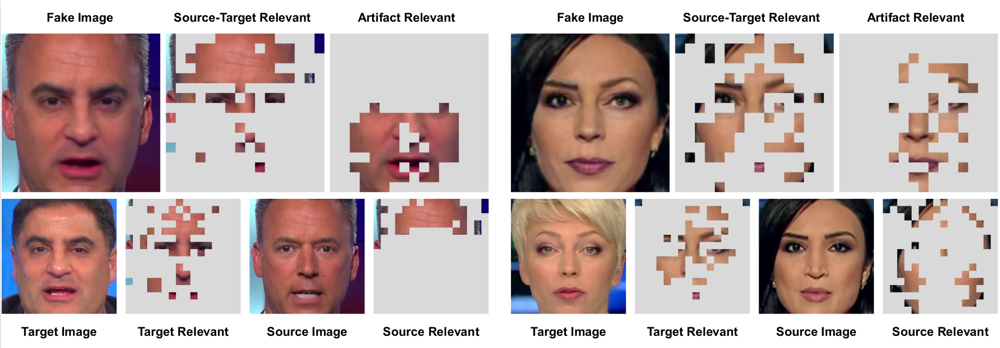

# FST-Matching

This repo includes the authors' [MegEngine](https://www.megengine.org.cn/) implementation of the [paper]() *Explaining Deepfake Detection by Analysing* 
*Image Matching*. 【ECCV 2022】

## Introduction

In this work, we interpret how deepfake detection models learn artifact features of images when just supervised by binary labels. 
To this end, three hypotheses from the perspective of image matching are proposed as follows. 

- Deepfake detection models indicate real/fake images based on visual concepts that are neither source-relevant nor target-relevant, that is, considering such visual concepts as artifact-relevant.
- Besides the supervision of binary labels, deepfake detection models implicitly learn artifact-relevant visual concepts through the FST-Matching (*i.e.* the matching **f**ake, **s**ource, **t**arget images) in the training set.
- Implicitly learned artifact visual concepts through the FST-Matching in the raw training set are vulnerable to video compression. 

In experiments, the above hypotheses are verified, which provides new insights to the task of deepfake detection. Furthermore, based on this understanding, we propose the FST-Matching Deepfake Detection Model to boost the performance of forgery detection on compressed videos. 



## Updates

- [x] [07/2022] demo code to verify the hypotheses
- [ ] code to train the source/target/detection encoder 
- [ ] code to train the FST-Matching Deepfake Detection Model
- [ ] code to test model performance

## Dependencies

* Python 3 >= 3.6
* MegEngine >= 1.9.1
* OpenCV >= 4.4.0
* scipy >= 1.4.1
* NumPy >= 1.19.5

## Data Preparation

1. Download the dataset from [FF++](https://github.com/ondyari/FaceForensics) and put them under the *./data*.

```
.
└── data
    └── FaceForensics++
        ├── original_sequences
        │   └── youtube
        │       └── raw
        │           └── videos
        │               └── *.mp4
        ├── manipulated_sequences
        │   ├── Deepfakes
        │		├── raw
        │			└── videos
        │               └── *.mp4
        │		├── c23
        │			└── videos
        │               └── *.mp4
        │		├── c40
        │			└── videos
        │               └── *.mp4
        │   ├── Face2Face
        │		...
        │   ├── FaceSwap
        │		...
        │   ├── NeuralTextures
        │		...
        │   ├── FaceShifter
        │		...
```

2. Download the landmark detector from [here](https://github.com/codeniko/shape_predictor_81_face_landmarks) and put it in the folder *./lib*.

3. Run the code to extract frames from FF++ videos and save them under the *./images.*

   ```
    python3 lib/extract_frames_ldm_ff++.py
   ```

## Quick start

#### A demo to verify hypotheses

You can run the demo on a few images first, which can be download [here](https://drive.google.com/file/d/16AqBypU9WZpiz85lLCssI2GNcXI7DS4d/view?usp=sharing).  Please put them in the folder *./images*.

Pretrained models for source/target/detection encoders can be found [here](https://drive.google.com/drive/folders/1na6ZpF-CeUiOX2i7wmVNW_gLODnTUYMa?usp=sharing). Please put them in the folder *./checkpoints*.

Results will be saved in the folder *./results*

```
python3  demo.py --hypothesis 1/2/3
```

#### Training models

We currently provide a demo code to train the source/target/detection encoder and the FST-Matching Deepfake Detection Model.

```
python3  train.py --dataset ./images --ld ./images/ld.json --model_type source/target/det/FSTMatching
```

#### Testing models

We currently provide a demo code to test the AUC of the model.

```
python3 test.py  --dataset ./images --ld ./images/ldm.json --model_type det/FSTMatching --epoch_num num
```

## Citation

Coming soon

## Contact

If you have any questions, please feel free to contact us via wangjin@megvii.com.
